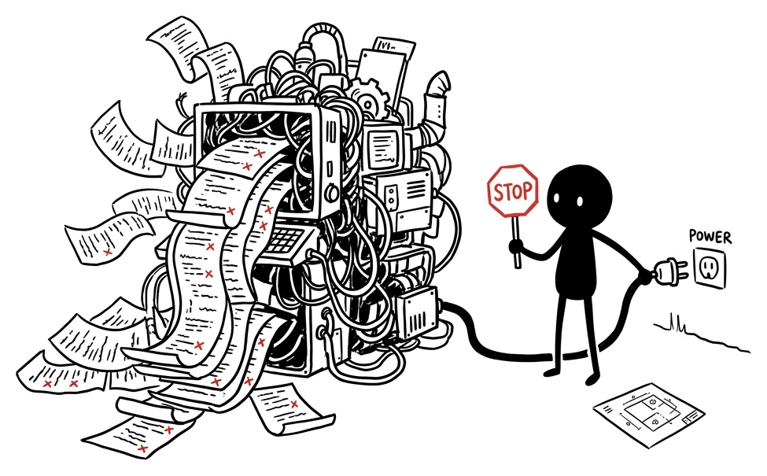
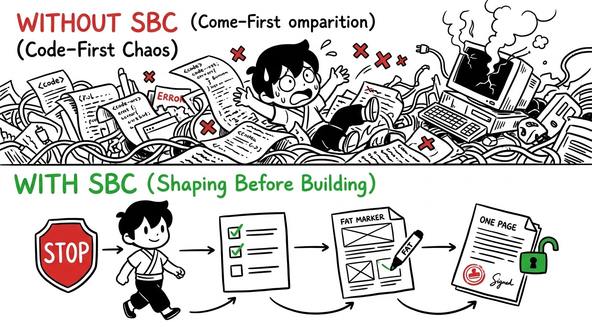
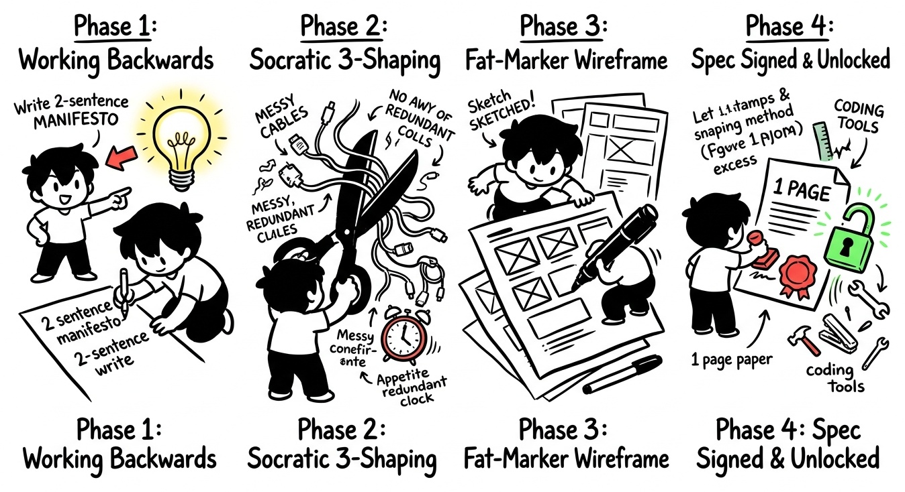

<div align="center">

# 🛑 Stop Before Code (SBC)

**面向 AI 编程智能体的“产品级防冲动思考与契约守门人”**  
*在定型产品的灵魂之前，别让你的 AI 写一行代码。*

[](https://opensource.org/licenses/MIT)
[](#-快速开始与多-agent-配置)
[](#-sbc-背后的产品哲学)
[](https://github.com/Koaaa-sysu/stop-before-code/pulls)

<p align="center">
  <a href="README.md"><b>English</b></a> | <a href="README_CN.md"><b>简体中文</b></a>
</p>

<p align="center">
  
</p>

</div>

---

> *“最大的浪费，莫过于用极高的效率造出了一个根本不该存在的东西。”*  
> —— **Marty Cagan**，《启示录（Inspired）》作者

---

## 💥 我们共同经历的噩梦

在当今前沿推理引擎与自主智能体（**GPT-6.1、CloudOps 5.5、Claude 4.5、Gemini 3 Ultra** 等）大行其道的时代，**生成上千行代码仅仅只需要几秒钟**。

然而，几乎每个开发者都经历过这种崩溃时刻：
1. 你随口对 AI 说了一句：*“帮我写个书签便签工具。”*
2. 你的 AI 瞬间兴奋，一通狂敲创建了 18 个文件，配齐了 Docker 容器、Redux、Tailwind、Prisma 以及 PostgreSQL。
3. 20 分钟后，屏幕上堆积着 30 个编译错误、版本依赖冲突，上下文窗口直接爆满。
4. **你本来只想要一辆自行车，AI 却试图造一艘航天飞机，最后把你的客厅砸得稀巴烂。**

<p align="center">
  
</p>

**Stop Before Code (SBC)** 是一个为 AI 编程智能体设计的标准技能包。它在所有文件写入和命令执行工具前设置了一道**物理级硬拦截锁**，直到你的需求被彻底定型、做完残酷减法，并签署成为一份一页纸的可执行产品契约。

---

## 🏛️ SBC 背后的顶层产品哲学

SBC 绝非随意的提示词拼凑，而是将硅谷数十年验证的世界级产品工程方法论提炼为了智能体可执行的刚性规则：

- **Basecamp《Shape Up》（Ryan Singer & Jason Fried）**：
  - **Appetite（胃口）替代工期估算**：不问“做这个要多久”，而是先问“你愿意为这个问题花多少时间（30分钟还是半天）”？超出胃口的功能直接砍掉。
  - **Rabbit Holes（兔子洞与时间黑洞）**：在写代码前肉眼识别出那些会吞噬时间的暗坑（如过早的复杂鉴权、过度设计的数据库），直接在契约中列为禁区（No-Gos）。
  - **Fat-Marker Sketches（粗笔草图）**：用粗线条的 ASCII 字符画在终端直观呈现界面与交互流，先看清形态再动工。
- **Marty Cagan《Inspired（启示录）》**：
  - 在第 0 秒扼杀 **Value Risk（伪需求风险）**，坚决不写没人用的冗余代码。
- **Amazon 逆向工作法（Working Backwards）**：
  - 在动笔画架构图前，先用 2 句话写出面向用户的极简发布宣言。

---

## ⚡ 4 步定型状态机引擎

每当你提出一个新想法或需求时，SBC 都会强制智能体进入严密的定型闭环：

<p align="center">
  
</p>

1. **第一阶段：逆向工作法（Working Backwards）** —— 用 2 句话写出极简发布宣言，明确目标场景、真实价值增量与极简交付形态。
2. **第二阶段：灵魂三拷问（Socratic 3-Shaping）** —— 必须且仅能提出 3 个带推荐项的选择题（胃口控制、暴力砍掉 3 个伪需求、自适应冷启动与容错体验）。
3. **第三阶段：粗笔原型草图（Fat-Marker Prototype）** —— 用极简粗线条手绘/文本框，即时在终端锁定界面布局与交互流转。
4. **第四阶段：契约签署与解锁（Pitch & Contract Signing）** —— 生成包含明确交付指标（DoD）的 `.product-spec.md`。等待开发者回复 `CONFIRM` 或 `确认`，物理代码锁正式解除！

---

## 🖥️ 实战案例 Showcase

阅读我们在真实开发场景下的完整对话与对局过程：

1. **[01. CLI 流式数据清洗工具](examples/01-cli-data-tool.md)**：从 500MB 大文件导致 OOM 崩溃，到 60 行标准库流式脚本一次性跑通。
2. **[02. Chrome 灵感收集插件](examples/02-browser-extension.md)**：砍掉 React 与 Webpack 构建黑洞，仅用 3 个原生文件和 Shadow DOM 实现零冲突秒测。
3. **[03. SVG 极简调色板 Web 单页](examples/03-fullstack-micro-saas.md)**：严禁搭后端与数据库，利用纯前端单 HTML 与 Web Workers 实现隐私绝对安全的本地批量处理。

---

## 🚀 快速开始与多 Agent 配置

### 方式 1：Claude Code
```bash
# 直接添加为全局技能
claude skill add stop-before-code
# 或复制规则到当前项目：
cp adapters/CLAUDE.md ./CLAUDE.md
```

### 方式 2：Cursor / Windsurf
直接将 `adapters/.cursorrules` 复制到你的仓库根目录：
```bash
curl -fsSL https://raw.githubusercontent.com/Koaaa-sysu/stop-before-code/main/adapters/.cursorrules -o .cursorrules
```

### 方式 3：Antigravity / Gemini Agent
将 `SKILL.md` 复制到你的全局或工作区技能目录：
```bash
mkdir -p ~/.gemini/antigravity/skills/stop-before-code
cp SKILL.md references/ ~/.gemini/antigravity/skills/stop-before-code/
```

---

## 📄 产物示例：`.product-spec.md`

定型完成后，SBC 会在根目录生成一份极其精炼（≤120行）的契约文件 `.product-spec.md`：

```markdown
# Product Spec: SVG QuickColor (单页 Web 应用)
> **Appetite**: 小型胃口 (30 分钟) | **Form**: 单 HTML 文件 (Alpine.js CDN)

## 1. 核心价值与 JTBD
- 当开发者需要在本地批量修改 SVG 图标颜色时，拖入浏览器即可即时拾色并打包为 ZIP 下载，隐私数据绝不离机。

## 2. 禁区与减法 (Anti-Scope / No-Gos)
- ❌ 不写后端服务器 / 不搭数据库
- ❌ 不做用户登录系统 / 不上云存储
- ❌ 第一版跳过复杂渐变标签处理（仅支持基础单色 Path 着色）

## 3. 冷启动与容错体验
- 首屏空状态：干净的虚线拖拽区，文案提示“将 SVG 拖拽至此，或点击浏览文件”。
- 容错韧性：采用 Web Workers 在后台处理，避免拖入 50+ 个文件时卡死界面。

## 4. 完成定义 (Definition of Done)
- [ ] 双击打开 `index.html`，拖入 3 个 SVG，拾色器变更为 `#FF5722`。
- [ ] 点击“下载 ZIP”，解压后校验 SVG 源码中的 fill 颜色生效无损。
```

**只有当你输入 `CONFIRM` 或 `确认` 后，Agent 的代码编辑器才会被正式解锁**，并严格按照契约中的每一条标准执行！

---

## 👥 创作者与结对开发

本项目由人机结对协作（Human-AI Pair Programming）共同构思与架构：
- **Minghao Lin** ([@Koaaa-sysu](https://github.com/Koaaa-sysu)) — 项目发起人与主架构师
- **Claude** (Anthropic) — AI 结对编程伙伴与规格评审
- **Antigravity** (Google DeepMind) — AI 结对编程伙伴与联合设计者

详见 [CONTRIBUTORS.md](CONTRIBUTORS.md)。

---

## 🤝 参与贡献与社区

我们坚信：**在自主编程时代，产品自律是个人开发者最宝贵的超能力。**

- 如果这个项目帮你的 AI 踩住了刹车，欢迎给仓库点上一颗 Star！⭐
- 欢迎提交 PR 适配更多 Agent 生态（如 Devin, Roo Code, Aider, OpenHands 等）。

---

## 📜 开源协议

本项目采用 [MIT 许可证](LICENSE) © 2026 Minghao Lin & 贡献者。
